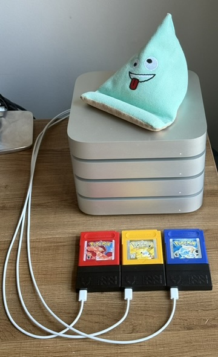

# OneFiveOne: AI + Pokémon = Nostalgia

<p align="center">
  
  
</p>
In the example above, running OneFiveOne using three [BennVenn Joey Jr. V2++](https://bennvenn.myshopify.com/products/usb-gb-c-cart-dumper-the-joey-jr) cartridge adapters to run Pokemon Red, Yellow, and Blue from their respective cartridges.

### Ahead of its time, or just ahead of mine?

In the U.S. releases of the original Pokémon games for the Nintendo Gameboy, there are 150 normally catchable pokemon spread across the 2 (and eventually 3) games:

Pokémon Red
Pokémon Blue
Pokémon Yellow

However, it was rare in my circle of friends for someone to have all three of 
1) a gameboy
2) a different version of the game
3) a parent who would let them bring both of them somewhere and trade

let alone enough of them at the same place in the game at the same time that we'd cover all of the different starter options.  Catching all 150 was a distant dream!  To add insult to injury, there was actually a 151st Pokémon, Mew, that was only available via special events!

### Avert your eyes if you don't like being reminded of how much time has passed!

These games came out over a quarter century ago. We were literally in a different *millenium* when Game Freak released these games.  The tech was... [different.](https://www.youtube.com/watch?v=yBdDtkjaoBQ)  There's a good chance your internet speed in 1999 was measured not in gigabits, not megabits, but rather *kilo*bits.  The largest ISP was [AOL](https://www.aol.com/news/2020-05-25-a-look-back-at-aols-history-as-an-internet-pioneer-and-what-the-future-holds-24283709.html). The idea of catching a Mew was out there, but there's a good chance that it was followed by a fake rumor that [Mew was under a truck](https://kotaku.com/that-time-some-players-thought-mew-was-under-a-truck-in-1792716938).

### A future that brought deeper understanding.

Time and tech have shifted and advanced, and that's given room for people to [analyze the heck](https://datacrystal.tcrf.net/wiki/Pokémon_Red_and_Blue/RAM_map) out of how these games work!  It's now possible to glitch an unmodified game to catch [all 151 on a single cartridge](https://www.youtube.com/watch?v=wtZ7CzbxBFM) including an actual [working Mew glitch](https://bulbapedia.bulbagarden.net/wiki/Mew_glitch)!  There are also incredible [Tool Assisted Speedruns](https://www.youtube.com/watch?v=-ivGNZs_Mvw)  (TASs) that automate the game using software to press the buttons automatically and perfectly.

However, both of these have a major dependency on a human being either creating the inputs or using software to precisely control them.  Enter [Peter Whidden's "Training AI to Play Pokemon with Reinforcement Learning](https://www.youtube.com/watch?v=DcYLT37ImBY)

Based on this idea, I wanted to build an AI that could catch all 151 Pokemon, including the ones that require special glitches!  However, unlike other TASs and speedruns that rely on human inputs, I want to see how much we can get the AI to do, and how little we have to train it ourselves, instead letting it "learn by doing."


### Setup and Dependencies:

I'm assuming a certain level of developer experience (for now).  I am assuming that you know how to set up a python virtual environment and install the appropriate version of [PyTorch](https://pytorch.org/get-started/locally/) for your particular platform and GPU.

I've tested this code on macOS Apple Silicon (using the mps accelerator) and both NVidia and AMD GPUs using the CUDA and ROCm acceleration respectively. If your environment is configured correctly, it will automatically select the GPU.  If not, it will fall back to CPU.

Ultra mega quickstart on macos:

   ```sh
   pythom -m venv venv
   source venv/bin/activate
   pip install -r requirements.txt
   ```


### Usage

To start training the model, use the following command:


### Command Line Arguments

- `--game_path`: Path to the game cartridge adapter.
- `--output_dir`: Directory where the model and other outputs will be saved. Defaults to ./ofo and ./ofo_chkpt
- `--state_file`: (Optional) Path to the state file to resume training.
- `--num_envs`: (Optional) Specify the number of environments to spawn for training.  Defaults to using all logical CPU cores

### Example

```sh
python3 onefiveone/learn.py --game_path=/path/to/cart/adapter --output_dir=/path/to/output --state_file=/path/to/state/file
```

This command will start training the model using the specified game path, output directory, state file, device, number of CPU cores, and training duration. Adjust the arguments as needed for your specific setup.


# Shoutouts and Thanks!

### Inspired by Peter Whiddon's amazing PokemonRedExperiments!

GitHub: [PWhiddy/PokemonRedExperiments](https://github.com/PWhiddy/PokemonRedExperiments)

YouTube: [Training AI to Play Pokemon with Reinforcement Learning](https://www.youtube.com/watch?v=DcYLT37ImBY)

His video and the code he generously shared are the reason I started this project!  He gave such a unique and fun twist on not just the ideas of AI playing the Pokemon games but also understanding why AI models behave in unexpected ways!  His video has over 7 *million* views now and it's been a blast following the updates to his project!

### Using Stable-Baselines3!

[Stable Baselines3](https://stable-baselines3.readthedocs.io/en/master/#) is a huge part of what made this possible.  Their development team was also quite helpful with my feature / pull requests!  Y'all rock!

### Gear bought from High Score! Tech Supply

[High Score! Tech Supply](www.highscoretech.com) was my source for both the BennVenn Joey Jr cartridge adapters and the games themselves.  Normally I wouldn't directly shout out a store like this and it's not a paid sponsorship or anything like that, but Kyle's customer support has been *excellent*!  The items were extremely well packed, and the little touches he puts in - *no spoilers! you'll have to find out yourself!* - really make you smile :)